# BloodMind — Autonomous Blood Coordination Network

AI-powered autonomous blood support network built for **Blood Warriors** to connect voluntary blood donors with Thalassemia patients across India.

---

## 📌 Table of Contents
1. [The Real-World Problem](#-the-real-world-problem)
2. [The Solution: BloodMind](#-the-solution-bloodmind)
3. [Key Modules & UI Screenshots](#-key-modules--ui-screenshots)
4. [System Architecture](#-system-architecture)
5. [AWS Integration Layer](#-aws-integration-layer)
6. [Detailed Step-by-Step Setup Guide](#-detailed-step-by-step-setup-guide)
7. [API References](#-api-references)
8. [Database & Seeding](#-database--seeding)

---

## 🩸 The Real-World Problem

Thalassemia is an inherited blood disorder where patients require regular blood transfusions—typically every **15 to 21 days**—to survive. 

In India, voluntary blood donor coordination faces severe challenges:
* **Reactive Coordination**: Coordinating requests manually via WhatsApp or calls when the patient is already in urgent need.
* **Donor Fatigue & Double Booking**: Contacting the same active voluntary donors repeatedly while thousands of eligible donors remain unreached.
* **Coordination Gaps**: Volunteers struggle to track transfusion schedules for thousands of patients simultaneously, leading to missed dates and critical health drops.
* **Communication Latency**: Outreach during emergencies is slow, language-restricted, and lacks automated escalation when donors don't respond.

---

## 💡 The Solution: BloodMind

**BloodMind** transforms blood coordination from a manual, reactive process into an **autonomous, proactive, and predictive system**:

* **Proactive Requests**: Predicts patient transfusion cycles in advance and automatically initializes blood requests 3 days before their due date.
* **Smart Allocation**: Employs compatibility ranking to suggest the top 5 compatible donors based on proximity, blood group, eligibility, and response rate, locking busy donors to prevent double-booking.
* **Personalized Outreach**: Automates notification and round-based escalation across SMS, WhatsApp, and Email using Generative AI (LLMs) to construct custom localized templates.
* **System Resilience (Self-Healing)**: Detects failures in blood banks or local coordinating nodes ("bridges") and automatically re-routes requests.

---

## 🖥️ Key Modules & UI Screenshots

### 1. Unified Dashboard
A high-level command center showing active request pipelines, predictive patient alerts, key metrics, and AWS system health status.
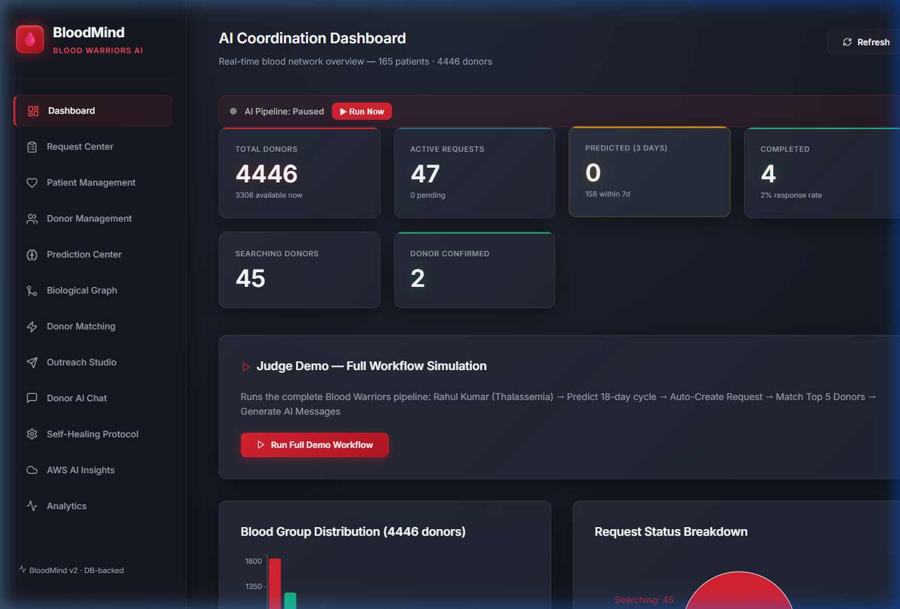

### 2. Patient Management
Manage patient records, track individual historical transfusion cycle lengths, and monitor exact days remaining until their next transfusion.
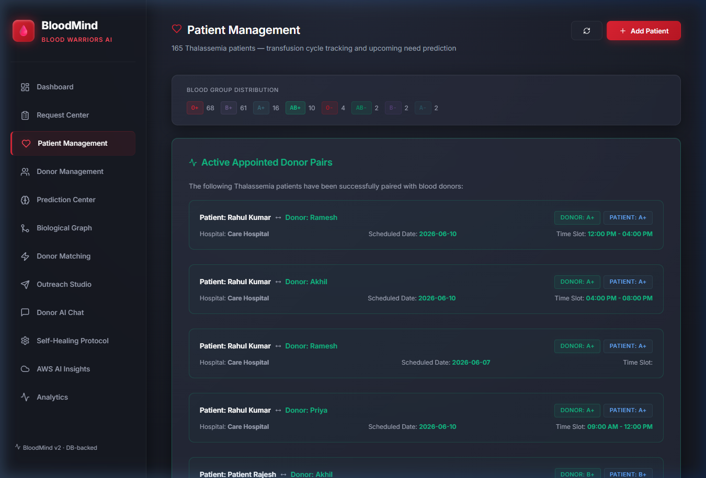

### 3. Donor Management
Maintains a detailed directory of voluntary donors. Tracks eligibility intervals (e.g., 90-day cooldown after donation), communication channels, and language preferences.
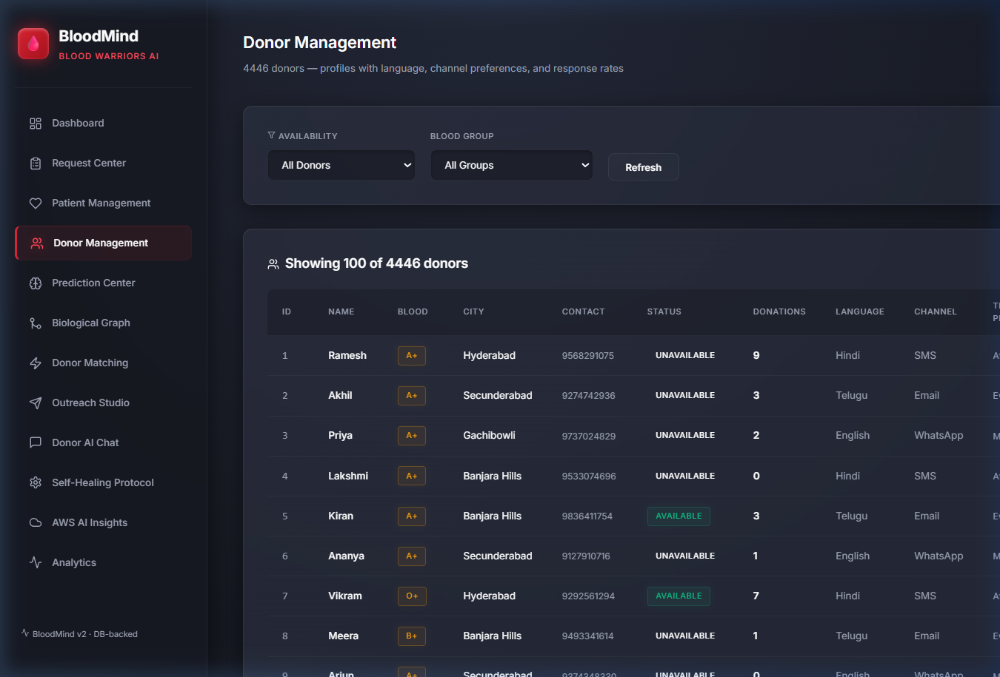

### 4. Prediction Center
Runs predictive algorithms to calculate the expected next transfusion date for patients. Allows direct scheduling and manual overriding.
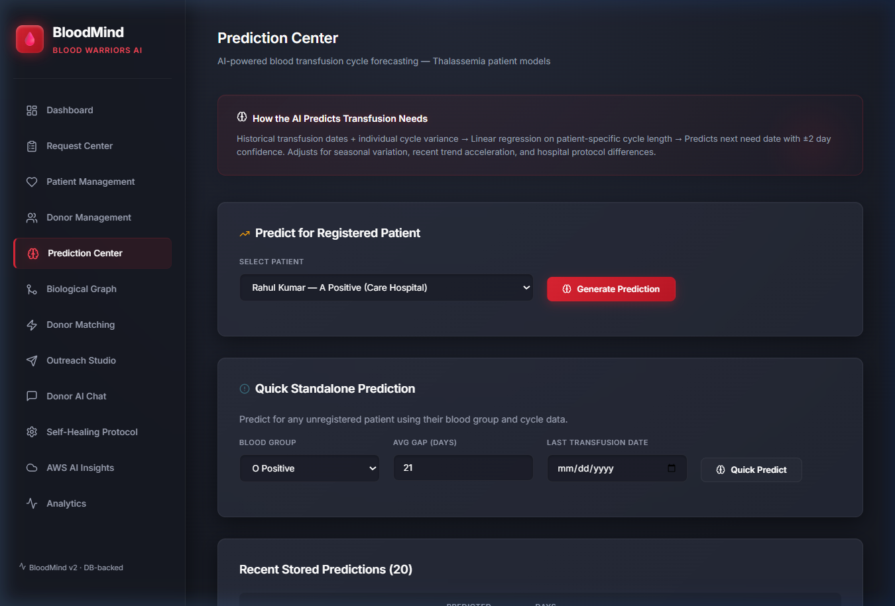

### 5. Biological Graph
Visualizes compatibility relationships between blood groups, bridges, and active requests using network graphs.
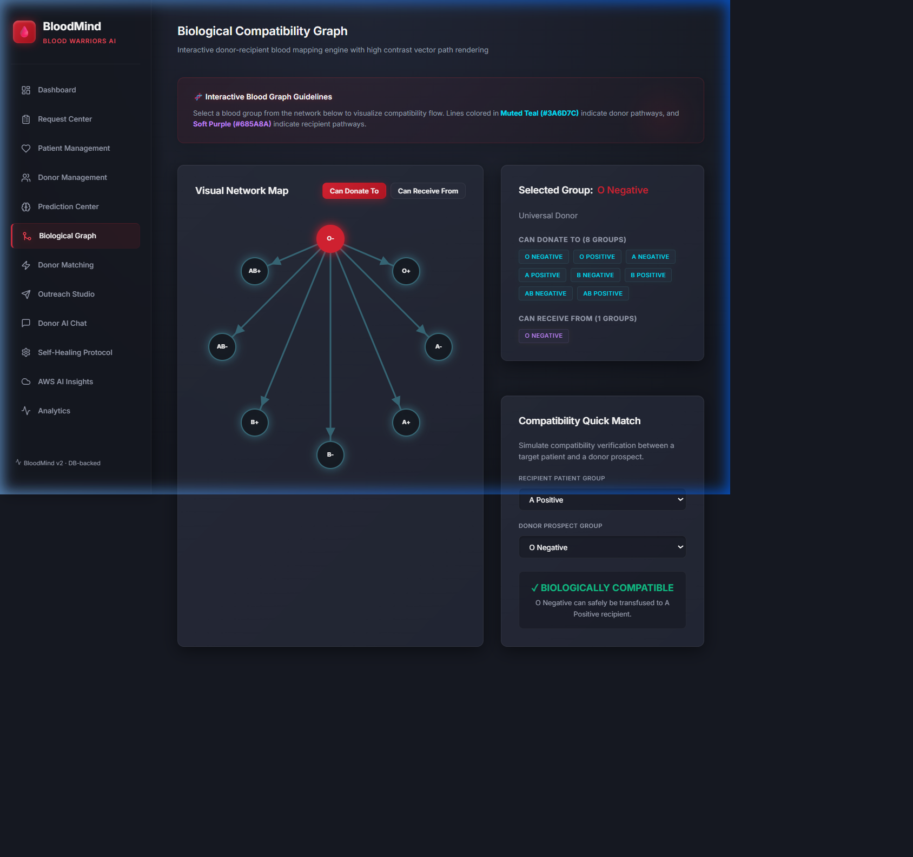

### 6. Donor Matching
Ranks the top 5 matching voluntary donors for any active request. Uses distance, eligibility cooldown, and historical response rates to prevent donor fatigue.
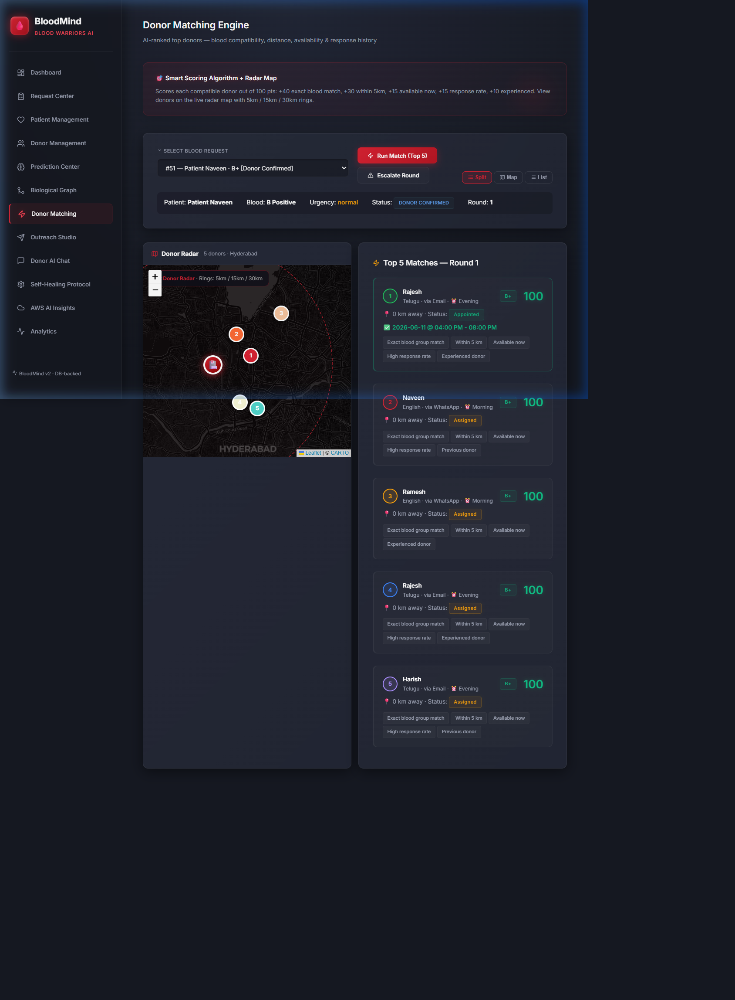

### 7. Outreach Studio
Generates personalized, multi-lingual outreach notifications using LLMs and facilitates round-based escalation (SMS ➜ WhatsApp ➜ Email).
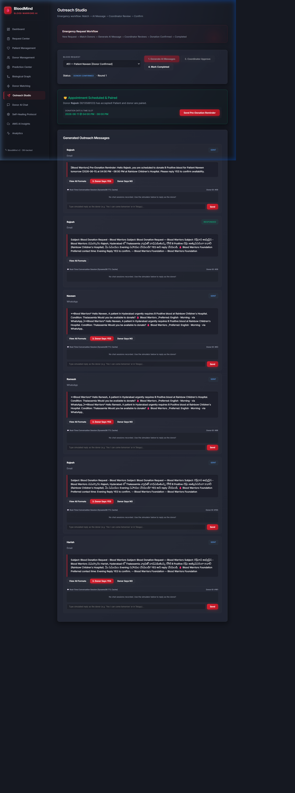

### 8. Donor AI Chat
Simulates communication with matching donors via virtual channels, logging responses directly back to the database.
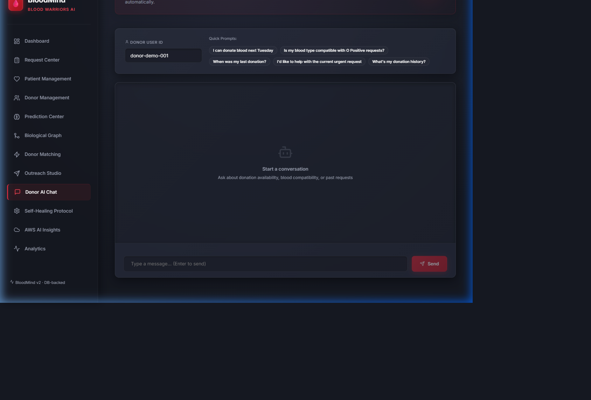

### 9. Self-Healing Protocol
Simulates node or blood bank failures. Shows how the coordination network automatically routes request handling to backup nodes.
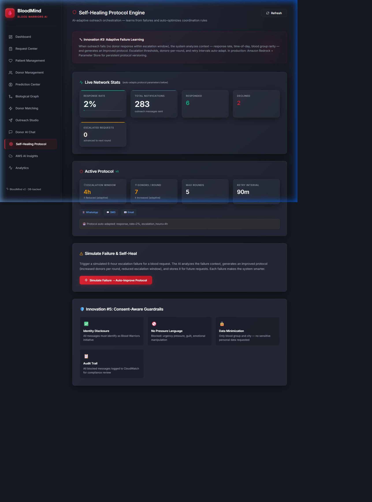

### 10. AWS AI Insights
Exposes real-time operations, Kinesis streaming events, and Amazon Bedrock prompt logging for complete auditability.
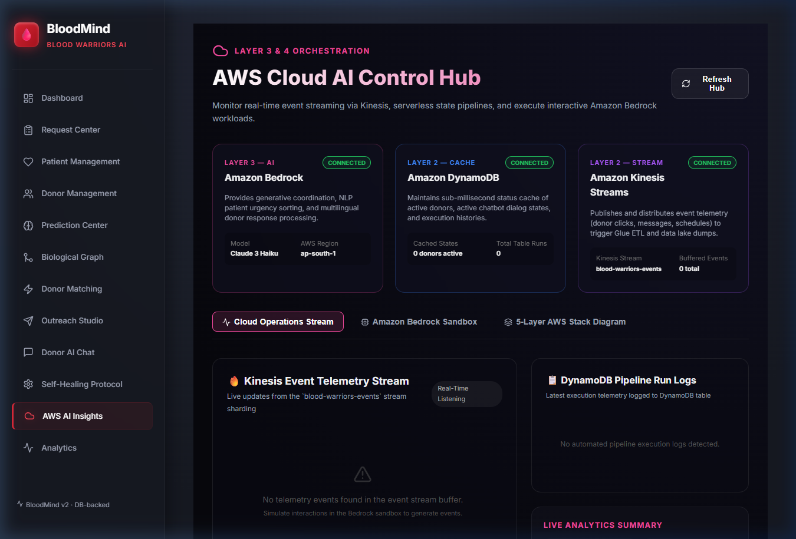

### 11. Analytics
Visualizes long-term response rates, failure percentages, and geographic distribution of blood bridges.
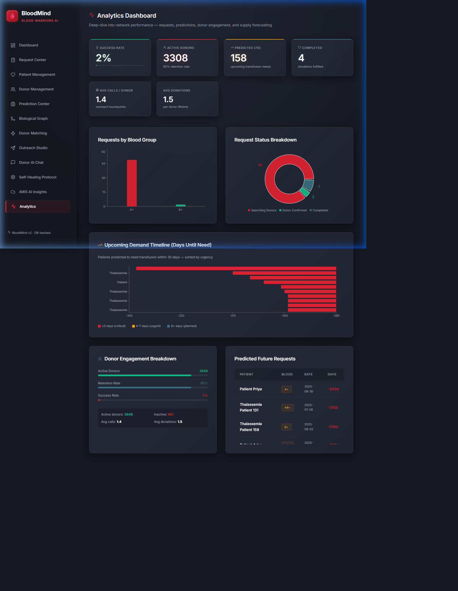

---

## 🏗️ System Architecture

```
                                  +-----------------------+
                                  |     React Vite UI     |
                                  +-----------+-----------+
                                              | (HTTP API)
                                              v
                                  +-----------+-----------+
                                  |    FastAPI Backend    |
                                  +-----+-----------+-----+
                                        |           |
                           (SQLAlchemy) |           | (Boto3 SDK)
                                        v           v
                          +-------------+---+   +---+-------------------------+
                          | SQLite Database |   |     AWS Cloud Services      |
                          | (bloodmind.db)  |   | (Bedrock, SageMaker,        |
                          +-----------------+   |  DynamoDB, EventBridge)     |
                                                +-----------------------------+
```

---

## ☁️ AWS Integration Layer

| Service | Role in BloodMind | Target Component |
|---------|-------------------|------------------|
| **Amazon SageMaker** | Daily cycle prediction & matching scoring | Transfusion Predictor, Match Engine |
| **Amazon Bedrock** | Formulates customized, multilingual notifications | Outreach Studio, Chat Simulator |
| **Amazon EventBridge** | Schedules daily cron tasks to run predictions | Event Scheduler |
| **Amazon DynamoDB** | Tracks active outreach conversation states | Chat Engine & Escalation States |
| **Amazon Kinesis** | Ingests real-time events from donor responses | Event Logging |

---

## 🛠️ Detailed Step-by-Step Setup Guide

### Prerequisites
Make sure you have the following installed on your system:
* **Python** (version 3.10 or higher)
* **Node.js** (version 18 or higher) & **npm**

---

### Step 1: Clone the Repository
```bash
git clone https://github.com/baddamHarshith29-Asus/bloodwarr.git
cd bloodwarr
```

---

### Step 2: Backend Setup (FastAPI)
1. Navigate to the backend directory:
   ```bash
   cd backend
   ```
2. (Optional but recommended) Create and activate a virtual environment:
   ```bash
   python -m venv .venv
   # On Windows (Cmd):
   .venv\Scripts\activate
   # On macOS/Linux:
   source .venv/bin/activate
   ```
3. Install the required Python dependencies:
   ```bash
   pip install -r requirements.txt
   ```
4. Start the backend server:
   ```bash
   uvicorn main:app --reload --host 127.0.0.1 --port 8096
   ```
   * The API docs will be available at [http://localhost:8096/docs](http://localhost:8096/docs)

---

### Step 3: Frontend Setup (React + Vite)
1. Open a new terminal and navigate to the frontend directory:
   ```bash
   cd frontend
   ```
2. Install the Node dependencies:
   ```bash
   npm install
   ```
3. Start the Vite development server:
   ```bash
   npm run dev
   ```
   * The application UI will be accessible at [http://localhost:5173](http://localhost:5173)

---

### Step 4: Database Seeding
On the first startup, the database auto-seeds using `Dataset.csv` located at the root of the workspace. If you want to force re-seeding:
1. Open the UI.
2. Go to **Dashboard** or click **Seed** option.
3. You can also trigger re-seeding via API:
   ```bash
   curl -X POST http://127.0.0.1:8096/api/v1/seed?force=true
   ```

---

## 🔗 API References

* `GET /api/v1/dashboard/v2` — Retrieves live KPI aggregates, predictive metrics, and active request statuses.
* `GET /api/v1/patients` — CRUD operations for Thalassemia patients.
* `GET /api/v1/donors/v2` — Fetches voluntary donor list.
* `POST /api/v1/predictions/run` — Runs the prediction pipeline.
* `POST /api/v1/requests/{id}/match` — Performs scoring & ranking to match top 5 eligible donors.
* `POST /api/v1/requests/{id}/outreach` — Triggers outreach messages to matched donors.
* `POST /api/v1/requests/{id}/escalate` — Escalates donor recruitment to the next matching round.
* `POST /api/v1/notifications/{id}/respond` — Simulates donor responding to outreach alert.
* `GET /api/v1/aws/status` — Monitors AWS connectivity status.

---

## 👥 Team
Built for the **Blood Warriors AI Hackathon 2025/2026**. Connecting technology with purpose to save lives. 🩸
